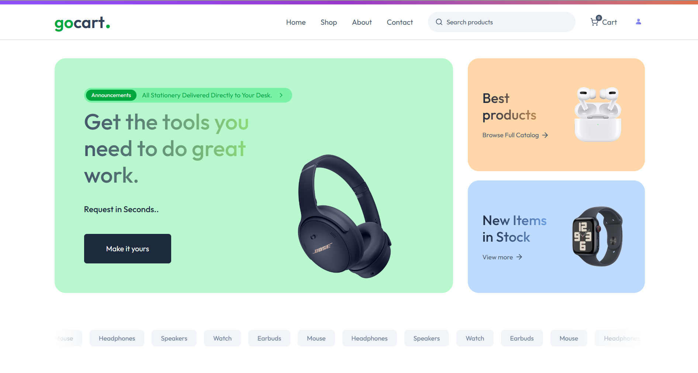
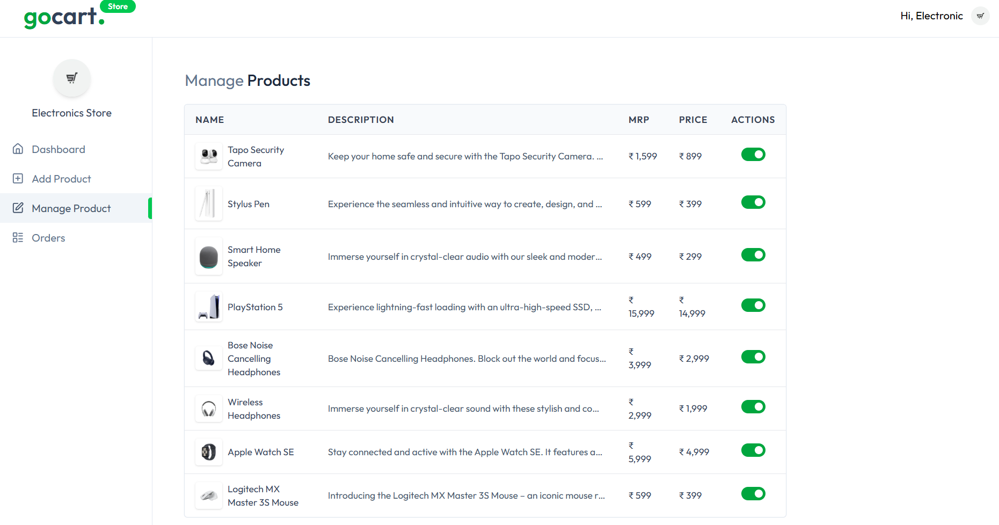
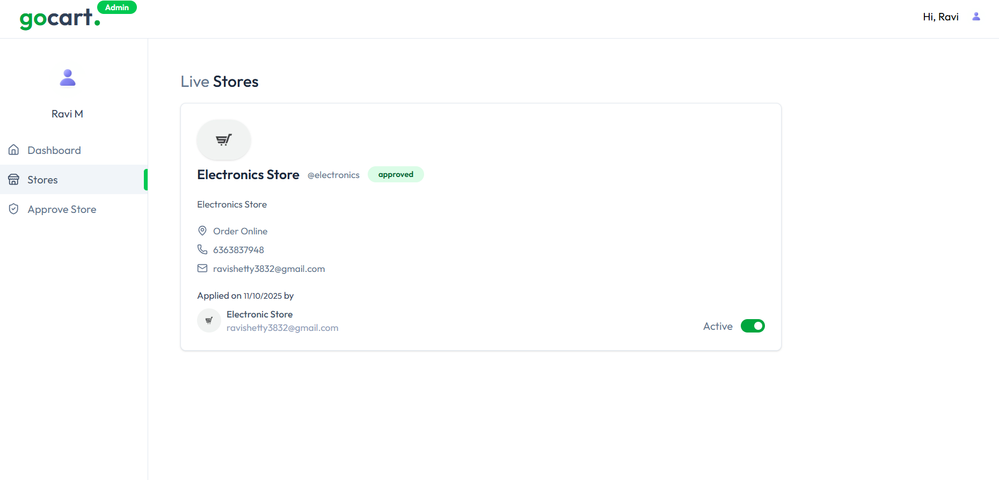
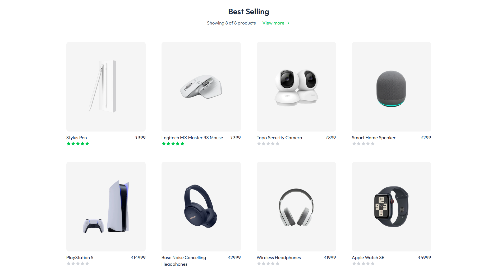

# 🛒 GoCart – Internal Stationery E-Shop (Prototype)

[](https://gocart-intrashop.vercel.app/)
[](https://github.com/Ravishetty07/GoCart)
[](https://nextjs.org/)
[](https://nodejs.org/)
[](https://neon.tech/)
[](https://tailwindcss.com/)
[](https://vercel.com/)

---

> ⚡ *GoCart is an internal multi-vendor e-commerce platform designed for organizations to manage stationery and office supply requests digitally.*

Employees can request items, sellers fulfill orders, and admins manage everything — with dashboards, analytics, and real-time updates.

---

## 🌐 Live Demo

🎯 **Explore Now:** [https://gocart-intrashop.vercel.app/](https://gocart-intrashop.vercel.app/)

---

---

## 🖼️ Project Visuals & UI Previews

| Section | Preview |
|----------|----------|
| **Employee Dashboard** |  |
| **Seller Panel** |  |
| **Admin Overview** |  |
| **Product Catalog** |  |


---

## ✨ Key Highlights

### 👩‍💼 Employee (Requester)
- Secure login via **Clerk Authentication**
- Browse stationery catalog (pens, notebooks, gadgets, accessories)
- Add items to cart and submit order requests
- Track order progress — *Pending → Approved → Delivered*
- View full request history in **My Orders / My Requests**

### 🏪 Seller / Store Manager
- Manage products (Add / Edit / Delete)
- View and process employee orders
- Update order status (*Processing → Shipped → Delivered*)
- Access employee details (name, department, delivery address)
- Seller dashboard with:
  - Total Orders
  - Total Earnings
  - Product Statistics

### 🧑‍💻 Admin Panel
- Approve / remove stores and vendors
- Monitor total stores, total products, and total revenue
- Manage global analytics and ensure smooth multi-vendor operation

---

## ⚙️ Tech Stack

| Layer               | Technology                                                           | Description                                    |
| :------------------ | :------------------------------------------------------------------- | :--------------------------------------------- |
| **Frontend**        | [Next.js](https://nextjs.org/) + React                               | Core framework for pages, routing & SSR        |
| **Styling**         | [Tailwind CSS](https://tailwindcss.com/)                             | Modern, responsive UI                          |
| **Backend**         | [Node.js](https://nodejs.org/) (Next.js API Routes)                  | API endpoints, logic & integrations            |
| **Database**        | [Neon PostgreSQL](https://neon.tech/)                                | Persistent storage for products, orders, users |
| **Authentication**  | [Clerk](https://clerk.com/)                                          | Role-based login (Employee / Seller / Admin)   |
| **Image Hosting**   | [ImageKit.io](https://imagekit.io/)                                  | Optimized product image delivery               |
| **Automation**      | [Inngest](https://www.inngest.com/)                                  | Event-driven workflows & background tasks      |
| **Payments**        | [Stripe](https://stripe.com/) *(optional)*                           | Secure transactions & order confirmations      |
| **AI Integration**  | [Google Gemini API](https://aistudio.google.com/apikey) *(optional)* | Smart recommendations & analytics              |
| **Hosting**         | [Vercel](https://vercel.com/)                                        | CI/CD & production hosting                     |
| **Version Control** | [GitHub](https://github.com/)                                        | Source management & collaboration              |

---

## 🧩 Core Functional Modules

| Module                | Description                                                   |
| --------------------- | ------------------------------------------------------------- |
| **Auth Module**       | Secure login, registration, and session handling using Clerk  |
| **Product Module**    | CRUD operations for sellers and product display for employees |
| **Order Module**      | Request creation, tracking, and seller updates                |
| **Admin Module**      | Manage stores, users, and system analytics                    |
| **Payment Module**    | (Optional) Stripe integration for checkout & payment tracking |
| **Automation Module** | Inngest workflows for background event handling               |

---

## 🛠️ Setup & Installation

### 🔹 Prerequisites

* Node.js (v18 or higher)
* Git
* Neon, Clerk, ImageKit, Inngest accounts
* (Optional) Stripe, Gemini API keys

### 🔹 Clone & Install

```bash
git clone https://github.com/Ravishetty07/GoCart.git
cd GoCart
npm install
```

### 🔹 Configure Environment

Create `.env.local` file:

```env
# Clerk Authentication
NEXT_PUBLIC_CLERK_PUBLISHABLE_KEY=your_clerk_publishable_key
CLERK_SECRET_KEY=your_clerk_secret_key

# Neon PostgreSQL Database
DATABASE_URL=your_neon_postgres_url

# ImageKit (Product Images)
NEXT_PUBLIC_IMAGEKIT_URL_ENDPOINT=your_imagekit_url
IMAGEKIT_PUBLIC_KEY=your_imagekit_public_key
IMAGEKIT_PRIVATE_KEY=your_imagekit_private_key

# Inngest Workflow Automation
INNGEST_API_KEY=your_inngest_api_key

# Stripe (Optional)
STRIPE_SECRET_KEY=your_stripe_secret_key

# Gemini AI (Optional)
NEXT_PUBLIC_GEMINI_API_KEY=your_gemini_api_key

# Admin
ADMIN_EMAIL=admin@yourcompany.com
```

### 🔹 Run Locally

```bash
npm run dev
```

Then visit ➜ **[http://localhost:3000](http://localhost:3000)**

### 🔹 Deploy on Vercel

1. Push to GitHub
2. Import repo into [Vercel](https://vercel.com/)
3. Add all environment variables in **Vercel → Project → Settings → Environment Variables**
4. Deploy 🚀

---

## 🧭 System Flow (Simplified)

1️⃣ Employee logs in with Clerk <br>
2️⃣ Browses catalog (Next.js pages)<br>
3️⃣ Adds items → Submits request<br>
4️⃣ Request stored in Neon (PostgreSQL)<br>
5️⃣ Seller receives notification → updates order status<br>
6️⃣ Admin monitors analytics and store performance<br>
7️⃣ Optional: Stripe payment processed & logged<br>

---

## 📊 Dashboards Overview

* **Employee:** Track requests, reorder items
* **Seller:** Monitor orders, earnings, inventory
* **Admin:** View analytics, approve stores, manage platform

---

## 🪄 Future Enhancements

* 🔒 Restrict login to official company domain (`@company.com`)
* 📨 Notification & email updates for order changes
* 📈 Graphs & insights in admin dashboard
* 🏦 Add wallet, coupons, and credit system
* 🤖 Integrate AI for order prediction & suggestions
* 📱 Develop a PWA / mobile-responsive app version

---

## 🧑‍💻 Developed By

**Ravi Shetty**<br>
💡 Full-Stack Developer | Web & AI Enthusiast<br>
🌐 [Live Project](https://gocart-intrashop.vercel.app/)
📂 [GitHub Repository](https://github.com/Ravishetty07/GoCart)
✉️ *[ravishetty05082@gmail.com](mailto:ravishetty05082@gmail.com)*

---

## 📝 License

This project is created for **educational and internal organizational prototype purposes**.
© 2025 **Ravi Shetty**. All Rights Reserved.

---

## 🌟 Support & Feedback

If you like this project, please ⭐ the repository and share feedback.
Your support motivates continued development! 🙌


